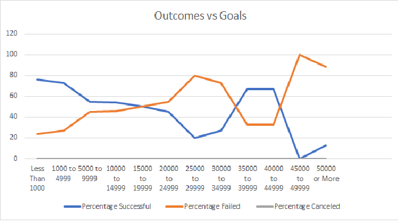

# KickstarterChallenge  with Excel

## Overview of Project
The overview is to perform data analysis on several thousand crowdfunding projects to uncover any hidden trends to help  Louise, a dramatist, to fund her Theater project.
### Purpose
The purpose of this project is to help Louise to start a crowfunding campaign. She wants to know how different campaigns are between their launch dates and their fundings goals.To do this , we will be using pivot charts, pivot tables, formulas, Unix Timestamps, and so on.
## Analysis and Challenges
On the first graph, a pivot table and pivot chart was made to show how many projects failed and succeed every year. This is helpfull to find a conclusion in which date will be better to launch a Theater project.
On the second graph, a function was made to count the "Number Successful,the "Number Failed," and the "Number Canceled" based on the "outcome" and the "goal" using the Subcategory "plays" .Then a percentage formula was used to made a simple chart.
### Analysis of Outcomes Based on Launch Date

### Analysis of Outcomes Based on Goals

### Challenges and Difficulties Encountered
One challenge that can be encountered is to use for the first time pivot chart and tables, also writing equations such as "=COUNTIFS(Kickstarter!$D:$D,"<1000",Kickstarter!$F:$F,"successful",Kickstarter!$R:$R,"plays")" are long and mistake can be made if you misplaces a letter, symbol, etc.
## Results

- What are two conclusions you can draw about the Outcomes based on Launch Date?

  1)The month that launched the most successful theater campaigns was May.
   
  2) November through January are bad to launch project. 
- What can you conclude about the Outcomes based on Goals?

  1) The higher the goal the project was a failure. The project was a succeess when less money was raised.
- What are some limitations of this dataset?

  1) One of the limitions is that we need more information why the campaigns failed, as well as what type of marketing was used.
- What are some other possible tables and/or graphs that we could create?

  1) Louise also mentioned that she is interesting to see how is the market in Great Britain 

